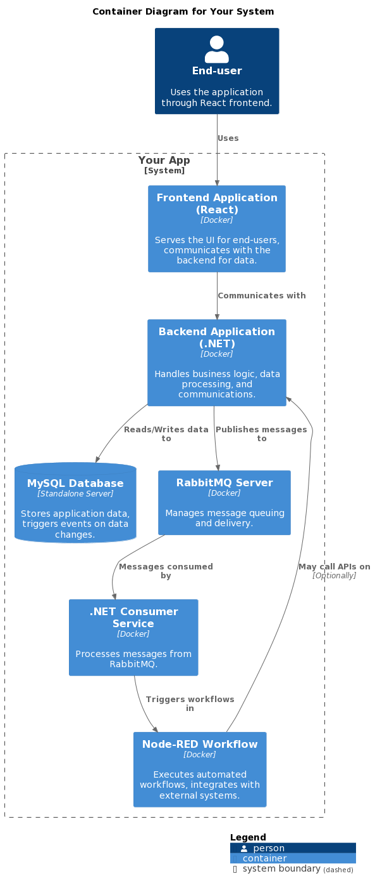

# Introduction to Node-RED

> Node-RED is a powerful programming tool that provides a browser-based editor for wiring together flows of data, applications, and APIs using a wide range of nodes. It's designed to help developers quickly connect hardware devices, APIs, and online services as part of the Internet of Things (IoT).

## Usage in NeoApps.AI Applications

> Within the context of applications created using NeoApps.AI, Node-RED plays a crucial role in enhancing functionality and enabling advanced integration capabilities. Here's how Node-RED is utilized:

- **Post-Processing Work**: Node-RED is used for post-processing tasks following database events. This allows for the automation of workflows and processes that need to be triggered after specific changes or updates in the database.

- **Leveraging Post-Event Driven Architecture**: By utilizing a post-event-driven architecture, Node-RED enables asynchronous communication and processing within applications. This approach decouples components of the system, allowing for scalable, flexible, and efficient application design.

- **Learning About Event-Driven Architecture**: For those interested in understanding more about event-driven architecture and its benefits, you can read it next section. The current architecture supports operations post-database events, activating workflows and processes as a response to these events.

**Current Limitations**: It's important to note that the current implementation within NeoApps.AI has specific limitations. For instance, Node-RED cannot be used to create databases or support systems where immediate, synchronous processing of database events is required without additional configuration or integration.

> The integration of Node-RED within NeoApps.AI applications underscores the platform's commitment to providing users with powerful, flexible tools for building and managing modern, event-driven applications. By facilitating easy post-event processing and workflow activation, NeoApps.AI enables developers to create more responsive and adaptable applications.

# Architecture Sequence of Events: From Frontend to Workflow

> The architecture sequence detailed below illustrates the flow of events from the frontend interface, through backend APIs, database interactions, message queuing with RabbitMQ, and finally to the execution of workflows in Node-RED. This sequence is pivotal in understanding how components interact within an event-driven system, ensuring efficient data processing and workflow management.

## Architecture Diagram

## Sequence of Events

1. **Frontend Interface**: The user interacts with the frontend interface, triggering actions that require data processing or retrieval.

2. **Backend API**: The frontend sends requests to the backend API, which handles business logic and interacts with the database as needed.

3. **Database**: The backend API performs operations on the database, such as CRUD (Create, Read, Update, Delete) actions. Database events (like insertions or updates) trigger notifications or messages to be sent to RabbitMQ.

4. **RabbitMQ Server**: RabbitMQ acts as a message broker, receiving messages from the backend and ensuring reliable delivery to the appropriate consumers. It decouples the database operations from their downstream processes.

5. **Consumer Services**: Consumer services listen for messages from RabbitMQ. Upon receiving a message, these services perform specific tasks or trigger additional processes based on the message content.

6. **Node-RED Workflow**: One of the consumer services may involve triggering a Node-RED workflow. Node-RED, utilizing the post-event-driven architecture, executes predefined flows that can include data transformation, calling external APIs, or integrating with other systems and services.

7. **Workflow Execution**: The Node-RED workflow processes the data or event, potentially interacting with other systems, APIs, or initiating further backend processes. The result of this workflow can be communicated back to the frontend or other parts of the system as required.

> This architecture emphasizes the decoupled nature of modern, scalable applications. By leveraging RabbitMQ for message queuing and Node-RED for workflow automation, systems can achieve high levels of efficiency, flexibility, and fault tolerance. The sequence outlined above ensures that each component focuses on its core functionality while supporting complex, asynchronous processing tasks.

# Understanding Post-Event-Driven Architecture

> Post-event-driven architecture (P-EDA) is an advanced pattern within the broader scope of software architecture, focusing on the decoupling of system components and promoting asynchronous communication and processing. It represents an evolution or specialized subset of event-driven architecture (EDA), with a particular emphasis on reacting to events after they occur, as opposed to directly triggering or anticipating these events.

> In the realm of EDA, system components interact by producing, detecting, and consuming events. An "event" is defined as a significant change in state or an occurrence of importance that necessitates communication to other parts of the system. This model boasts high scalability, flexibility, and responsiveness, catering to environments where rapid propagation of state changes is essential.

> P-EDA distinguishes itself by concentrating on post-event actions, focusing on the processing and handling of events to kickstart workflows, processes, or further event emissions. This facet is especially beneficial in contexts where the immediate reaction to an event is less critical than the processes it initiates.

## Key Features and Advantages

- **Decoupling of Components**: Systems are built with loosely coupled components that interact through events, simplifying scaling and modifications without affecting other components.

- **Asynchronous Processing**: Events are handled asynchronously, enhancing system responsiveness and efficiency by preventing operation blocks during processing.

- **Scalability**: The architecture's decoupled nature and support for asynchronous operations facilitate easy scaling to manage increased loads.

- **Flexibility and Adaptability**: Introducing new behaviors or modifying existing ones can be achieved by implementing new event handlers or adjusting current ones, without major architectural overhauls.

- **Fault Tolerance**: Enhanced system resilience to component failures, where the failure of one component does not severely impact others. Event processing mechanisms can manage recovery or retry strategies.

> Technological implementations of P-EDA often involve message queues, event streams, and event brokers (e.g., Apache Kafka, RabbitMQ, AWS EventBridge), enabling efficient and reliable event transmission and processing across the system.

## Application in Database Event-Triggered Workflows

> The [architecture](#architecture-diagram) detailed earlier aligns with the Event-Driven Architecture (EDA) framework, emphasizing a pattern in which database actions trigger events that are subsequently broadcasted to initiate workflows. This model excels at facilitating processes beyond the database in response to changes in the database state.

### Components:

- **Database Event Triggers**: Database operations trigger events.
- **Event Broadcasting**: Events are broadcasted through an event bus or message broker.
- **Message Consumption**: Separate services or processes consume these messages.
- **Workflow Activation**: Consumers activate workflows based on the received messages.

> This setup excels in decoupling database operations from application logic, enabling rapid response to database changes and scalable, modular system design.

## Limitations in Specific System Implementations

> While versatile, certain system types or functionalities may pose challenges within this architecture, such as:

- **Real-Time Processing Systems**: Achieving low-latency real-time processing might require additional optimization.
- **Highly Transactional Systems**: Managing complex transactions and ensuring data consistency across distributed systems can introduce complexity.
- **Tightly Coupled Systems**: The asynchronous, decoupled nature of EDA might not suit systems requiring synchronous operations or immediate feedback.
- **Legacy Systems Integration**: Adapting legacy systems to fit into an event-driven model may necessitate extra adaptation layers.
- **Systems Needing Immediate Data Consistency**: Ensuring immediate consistency in an asynchronous environment might be challenging, requiring specific techniques like event sourcing or CQRS.
- **Direct Query-Response Interactions**: This architecture is not naturally suited for direct query-response interactions, which may need additional mechanisms for synchronous communication.

> To navigate these challenges, incorporating additional architectural patterns, employing hybrid approaches, or leveraging specific technologies can expand the range of effectively implementable system types within a post-event-driven framework.
