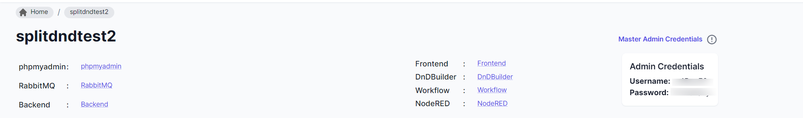
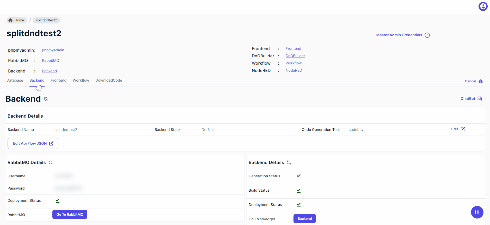

> Unlock the power of independent backend generation with Neoapps.AI, providing compatibility with any popular app builder supporting OpenAPI. Our platform offers two distinct methods for backend generation, allowing you to tailor the solution to your specific needs.

> Two methods for backend generation:

1. **Create Regular Restful API**

   > Neoapps.AI simplifies backend generation with the creation of Regular Restful APIs. These APIs encompass a wide array of endpoints, catering to diverse functionalities within your application. Key features include:

   - **CRUD Operations**: - Create: Establish endpoints for creating new records or entities. - Read: Access data through read endpoints for seamless retrieval. - Update: Modify existing records or entities through designated update endpoints. - Delete: Remove records or entities securely with dedicated delete endpoints.
   - **Relational APIs**:
     Establish relationships between entities, enhancing data connectivity.
   - **Reporting APIs**:
     Enable powerful reporting capabilities, allowing you to extract insights from your data.

2. **Use AI Template**
   > Neoapps.AI introduces an innovative approach to backend generation through AI Templates. While specific details are yet to be disclosed, refer to our roadmap for in-depth information on leveraging AI Templates for backend creation. This method promises to streamline the process further, utilizing artificial intelligence to enhance the efficiency and sophistication of your backend infrastructure.

> After successfully deploying the backend, explore its APIs and RabbitMQ server. You can interact with APIs using swagger, test message passing in RabbitMQ, and perform integration testing.

### How to Open RabbitMQ Server ?

> To access the RabbitMQ server, users must first navigate to the backend section and then click on the 'Go to RabbitMQ' button.

> Login in The rabbitmq using generated 'Master admin credentials'

### How to access Swagger?

> To access the generated backend, users need to click on the 'Backend' button.

> **Note**: To test APIs, please refer to the documentation provided below for testing APIs in Swagger.

- [How to use APIs in swagger?](../api-testing.md)
