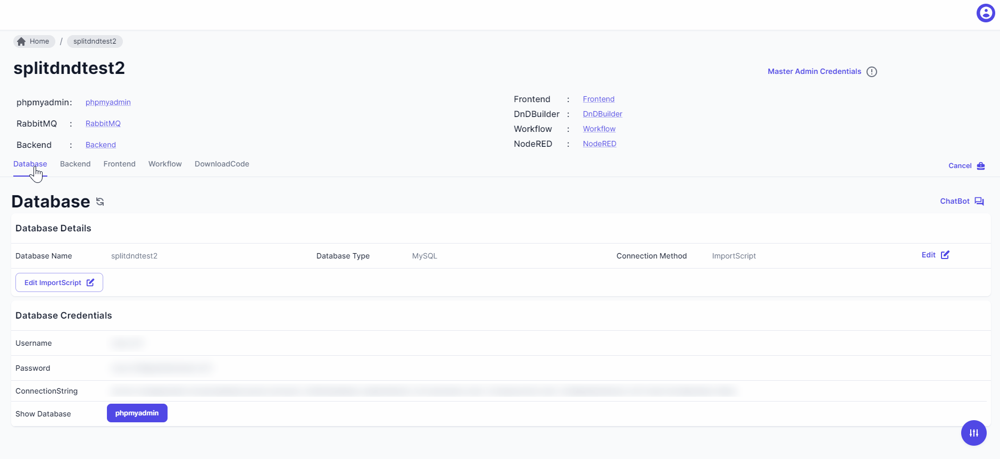

> Empower your application with a robust database using Neoapps.AI's flexible and user-friendly database creation methods. Choose from three distinct approaches to tailor the database setup to your specific needs.

> There are three ways to create a database:
1. **Import Your Own Script**
    > Follow these straightforward guidelines to create a database by importing your own script. This method allows for seamless integration of existing database structures into Neoapps.AI. Simply adhere to the provided guidelines for database creation, ensuring a smooth and efficient process..

    <!--  -->
2. **Design Database on Portal**
    > Leverage the intuitive database designer on the Neoapps.AI portal to craft a customized database for your application. This user-friendly interface enables you to define the structure of your database with ease. Design tables, establish relationships, and set up the necessary components to create a database that perfectly aligns with your application requirements.
3. **Connect to an Existing Database**
    > For apps built on the current AI platform, reuse the database.
    
    > Discuss scenarios for connecting to an existing database, like managing large databases or separating portal instances and traffic loads.

### Open Database in Phpmyadmin

> After compliting the above steps you can view your created databases in the Databases section of the portal. Also you can access you Database by clicking on 'phpmyadmin' button .

> You can login in phpmyadmin by entering generated Username and password . 
