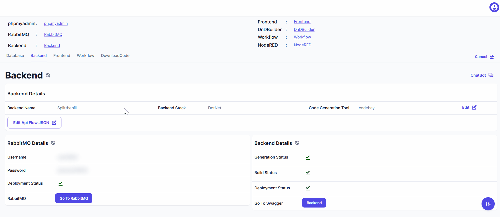

> Learn to create two versions of your frontend user interface:

    1. **DND designer**
    2. **Actual frontend website**

### How to generate DND(Drag & Drop) Builder ?

### How to Open DND builder?

> Effortlessly access the DND configuration page post-portal generation by simply clicking on 'DNDBuilder', streamlining your customization experience.

### Next Step

> Refer below links for configure Drag & drop Components.

- [How to Use Drag & Drop Components](../../dnd-usage/working-with-components.md)
