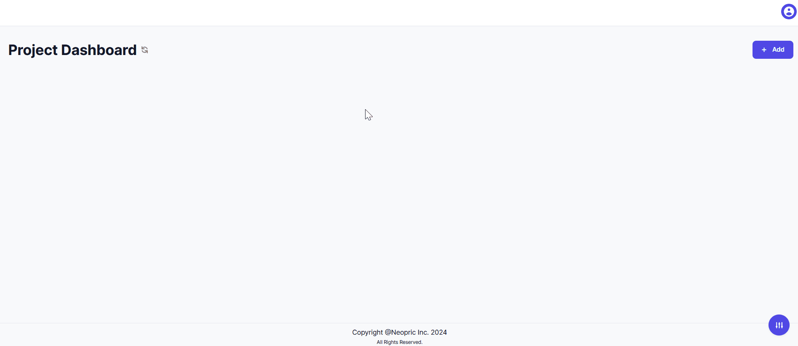
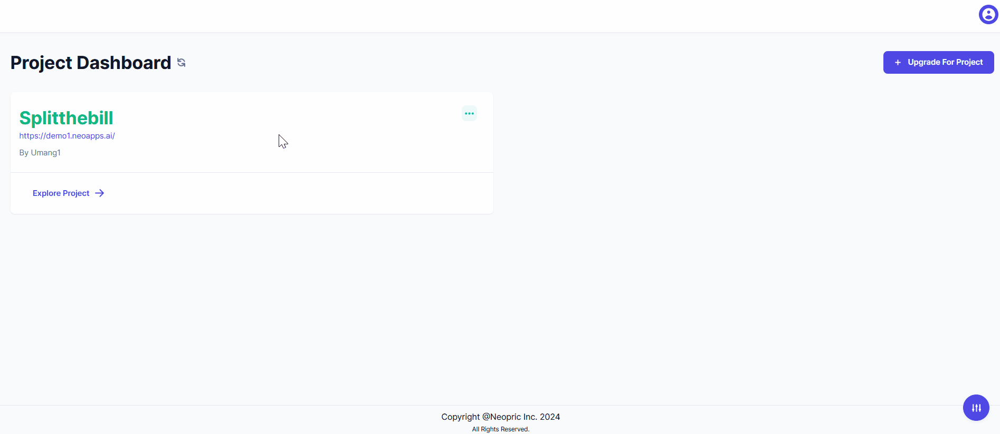

> Click the "New Project" button from your dashboard.
> Name your project and configure initial settings.
    - Use a valid Name.
    - Create a subdomain.
        - Enter a valid name.
        - Ensure the domain is not already in use.

> Navigate your project dashboard and its details.

> Familiarize with various messages.

