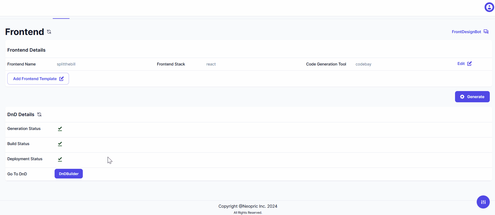

> Generate Node-RED workflows.

> Explore various uses of Node-RED workflows to connect your application to other apps/RESTful APIs.You can refer this below link for exploring the sample flows. 

- [Uses of Node-red](../../nodered-usage/sample-flow.md)

> Learn to use Node-RED workflows as a webhook to connect independent applications of the neoapps.ai portal.

> After Workflow generation you can refer this below link for Node-red Configuration .

- [How to Configure Node-red](../../nodered-usage/nodered.md)
