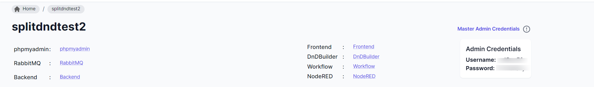
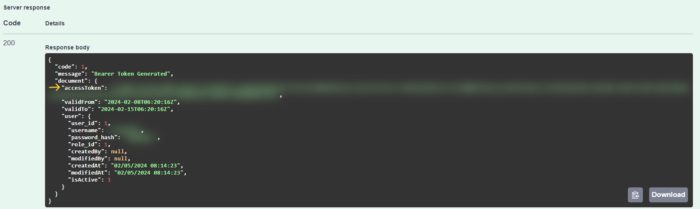

### Getting Started

> This section will guide you through the process of generating a token and authenticating all APIs using that token before testing APIs.

### How to Generate a token?

> Access the Swagger interface and locate the token generation endpoint.

> Click "Try it out" to initiate the process, 

> Now enter your credentials obtained from the project portal's "Master Admin Credentials" section.

> Execute the request to generate the authentication token.

### How to get authenticated before using APIs?

> After generating the token, locate it in the "accessToken" field.

> Copy the entire token.
> Navigate to the Authorization tab, typically located at the top right side of the Swagger page.
> In the input field, type "Bearer" followed by a space. Paste the copied token after "Bearer" in the same input field.

> This action authenticates your requests, enabling access to protected resources via the Swagger interface.

### Next Step

> Once authenticated, you're ready to begin testing the generated RESTful APIs. You can explore various endpoints, send requests with different parameters, and analyze responses to ensure the APIs function correctly and meet your requirements. 