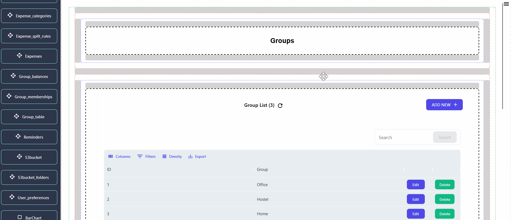
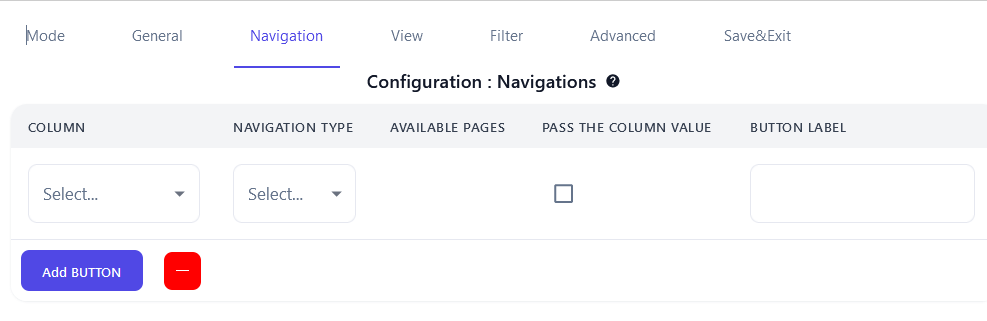

## Getting Started

> This section provides instructions for configuring navigation mode, enabling users to pass variables by clicking the button. This feature streamlines data exchange . 

## Navigation Mode

> This feature involves a page displaying a table of groups. When a user clicks on **"members"** or **"balance"** for a specific group, the corresponding group ID is passed to another page, as configured in the navigation section. On this subsequent page, data associated with the provided group ID is presented, offering users detailed insights into the selected group's information and attributes.

### Steps for using navigation mode:

1. CLick on the Data table components that you want to configure.
2. Go to **"Navigation Tab"** in Properties panal.

3. Click on **"Add Button"** button for adding Navigation properties.

    - The **"Column"** field allows users to designate the data fields of the respective components they wish to pass to the next table.
    - For navigation, users select the type of page in **Navigation Type** determine which type of page to naviagate. 
    - The **"Available pages"** section presents a list of pages of the chosen navigation type.
    - Users can decide whether to pass the selected column value to the next table by toggling the checkbox in the **"Pass the column value"** section.
    - Furthermore, users can label the button displayed on the particular page using the **"Button Label"** field, providing a personalized touch to the navigation experience.

4. After configuring the navigation mode, finalize the changes by clicking the **"Save & Exit"** button. This action ensures that the configured settings are saved, allowing users to exit the configuration interface promptly.

>  To grasp the outlined steps effectively, refer to the following procedural guide for clarity and detailed understanding.

