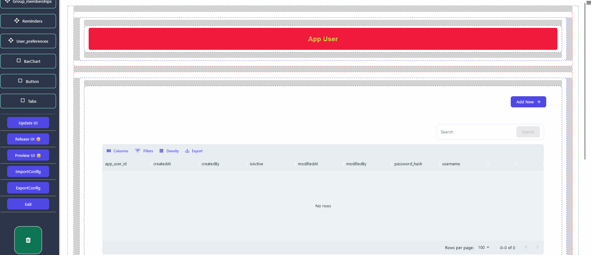
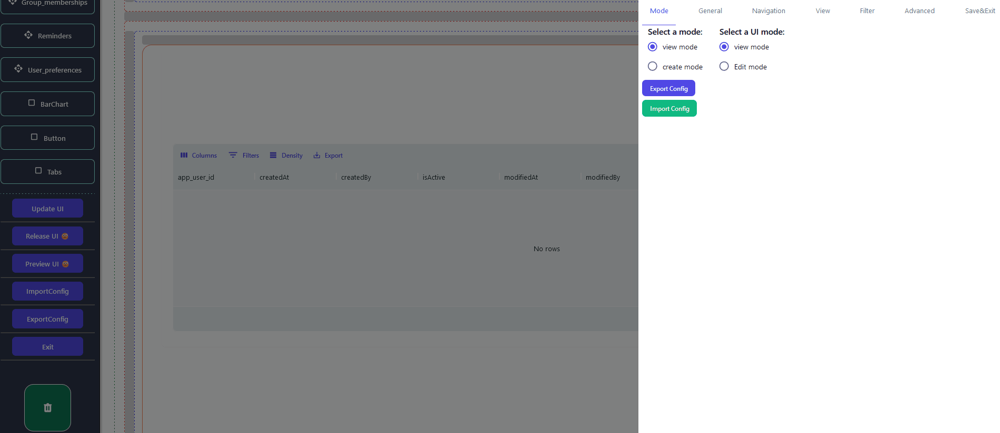

> The [NeoApps.AI](https://neoapps.ai/) offers powerful functionalities through view and edit modes, allowing users to display data and make updates to existing records. This guide covers setting up these modes for your application components.

## Configuring View Mode

> View mode enables you to display data in your app. Here’s how to set it up:

1. Select the component you wish to configure for viewing data.
2. In the component's settings panel, locate the **Mode** option and select **View**.

3. Configure the data source to determine which data is displayed in the component.

<!--  -->

## Customizing Data Display

> You can customize how data is displayed in view mode:

- **Column Selection**:

  - Choose which columns of your data source are visible.

  

- **Formatting Options**:

  - Apply formatting to better present your data, such as date formats or conditional styling.

- **Sorting and Filtering**:
  - Enable sorting and filtering options for users to easily navigate through the data.

<!--  -->

## Enabling Edit Mode

> Edit mode allows users to update existing records directly within your app:

1. Ensure the component is already configured to display data in view mode.
2. Activate edit mode by selecting the **Enable Editing** option in the component’s settings.
3. Define which fields can be edited and set any necessary validation rules for data integrity.

<!--  -->

## Implementing Inline Editing

> For a seamless user experience, you can implement inline editing:

- **Inline Edit Triggers**:
  - Configure the component so that a double-click on a data row or an edit icon click enables inline editing.
- **Save Mechanism**:
  - Provide a straightforward way for users to save changes, such as an "Apply" button within the row being edited.

<!--  -->

## Testing View and Edit Functionalities

> It's crucial to thoroughly test view and edit modes to ensure data integrity and user experience:

1. Preview your app and navigate to the component configured in view and edit modes.
2. Experiment with viewing data, applying filters, making edits, and saving changes.
3. Verify that all changes are accurately reflected in your data source.

<!--  -->

## Next Steps

> With view and edit modes configured, your app will be much more interactive and user-friendly. Consider exploring additional functionalities to enhance your application further:

- [Advanced View Configuration](./grid-view.md)
- [Navigation Mode Configuration](./navigation-mode-configuration.md)
- [Enhancing User Experience](../enhancing-user-experience)

> View and edit modes are integral to creating dynamic applications that allow users to interact with the data meaningfully. By following this guide, you can ensure these functionalities are well-implemented in your application.
