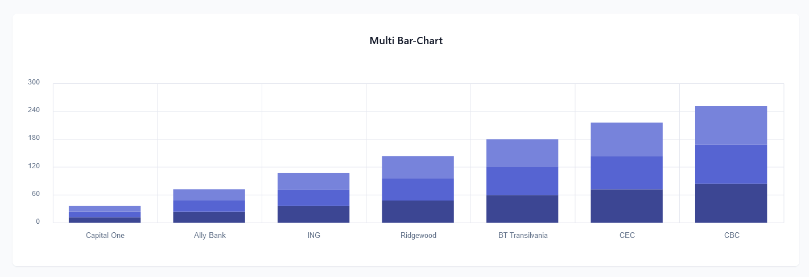
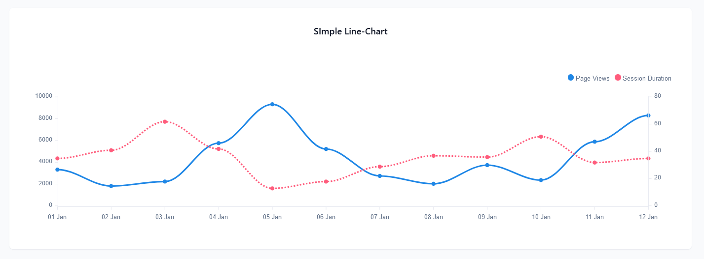

## Getting Started

> In this section, you will learn about the various types of charts supported by our application and how to configure your chosen chart using the drag-and-drop (DnD) builder.

## Type of Charts 

> We offer three main types of charts, each with various versions available inside. You can configure these charts according to your specific requirements, ensuring flexibility and customization options to meet your needs.

### Bar-Chart 

#### 1. Simple Bar Charts

#### 2. Multi Bar Chart

### Line-Chart 

#### 1. Simple Line Chart

#### 2. Shadow Line Chart

#### 3. Straight Line Chart

#### 4. Complex Line Chart

### Pie-Chart 

#### 1. Simple Pie Charts

#### 2. Complex Pie Chart

