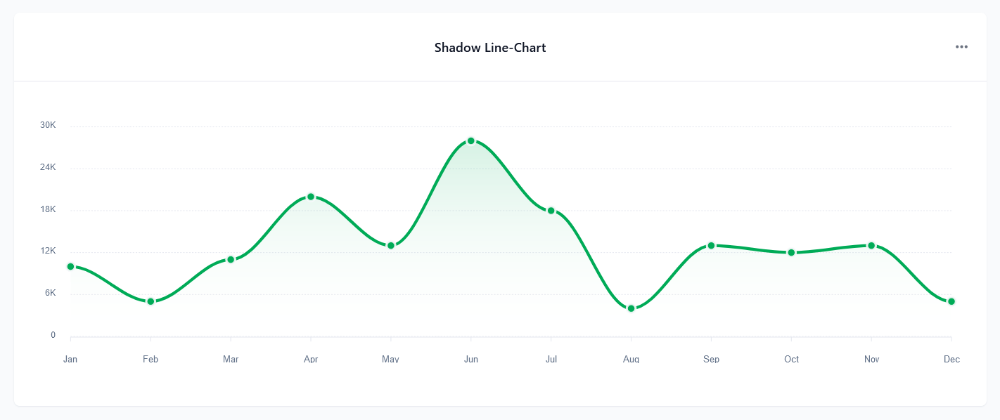

## Getting Started

> In this section, you will learn about the various types of charts supported by our application and how to configure your chosen chart using the drag & drop (DND) builder.

## Type of Charts

> We offer three main types of charts, each with various versions available inside. You can configure these charts according to your specific requirements, ensuring flexibility and customization options to meet your needs.

### Bar-Chart

#### 1. Simple Bar Charts

#### 2. Multi Bar Chart

### Line-Chart

#### 1. Simple Line Chart

#### 2. Shadow Line Chart

#### 3. Straight Line Chart

#### 4. Complex Line Chart

### Pie-Chart

#### 1. Simple Pie Charts

#### 2. Complex Pie Chart

## How to Use Chart Component in DND ?

> The **Barchart** component in the DND builder provides a comprehensive range of chart types for data visualization needs. From line graphs to pie charts, users can effortlessly create visual representations of their data. Simply drag and drop the **Barchart** component onto your page to access a versatile toolkit for presenting and analyzing data with ease.

> **General Settings** :

- Here you can see there are two dropdowns. The first dropdown selects chart types for customizable visualization, while the second dropdown triggers data presentation in Node-RED via selected paths, optimizing user control and flexibility.

- Our interface features a "Select Value" dropdown offering default paths. Upon selection, only the chosen path activates the corresponding Node-RED workflow. To fully utilize this feature, users need to configure the flow and provide the requisite data for visualization in the chosen chart.

- If you want to add your custom path for trigger flow in node-red , In the upcoming session, we'll cover the option to include custom trigger paths for Node-RED flows. This feature allows users to add their unique pathways through Node-RED, enhancing flexibility. Additionally, we'll delve into detailed configurations for each chart type, providing comprehensive guidance for optimal setup.

  - [Chart Component | Node-red Configuration](./chart-node-red-configuration.md)
