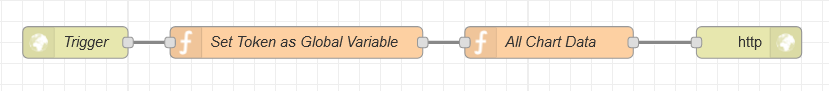
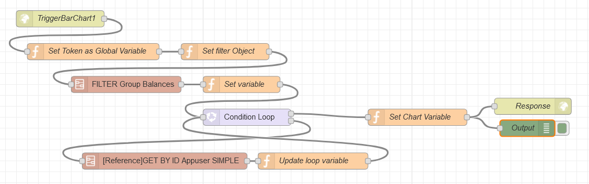
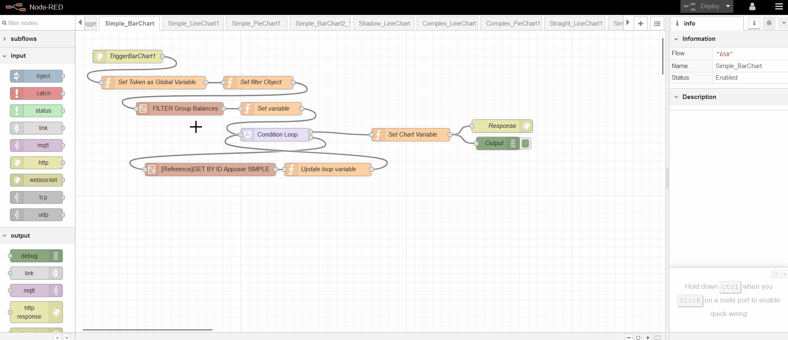
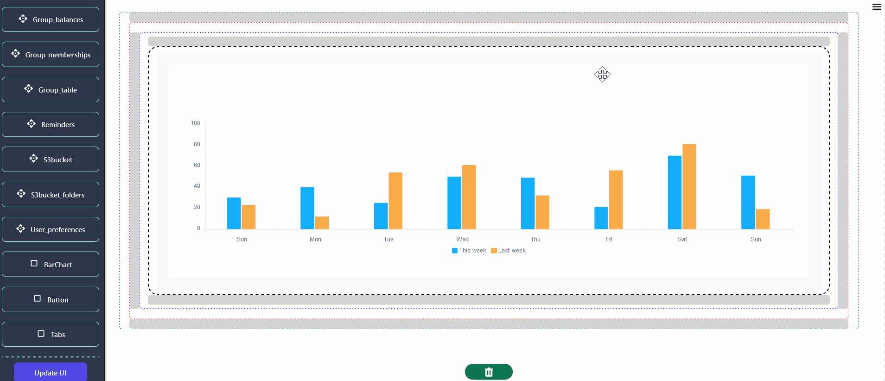

## Getting Started

> This section serves as a comprehensive guide to seamlessly integrating data from Node-RED flows into the Chart component. It offers detailed instructions on configuring prebuilt flows tailored to specific chart types within Node-RED, ensuring efficient data presentation customized to individual needs. Additionally, it covers the configuration of custom paths for triggering workflows in Node-RED, enhancing flexibility and adaptability within the system.

## Configuring Custom Paths in Node-RED for Chart Components: A Step-by-Step Guide

> To set up custom paths, locate and access the 'All Chart Data Trigger' flow within your Node-RED environment.



> You can easily import the aforementioned flow into your Node-RED instance by copying the following JSON code

```
[{"id":"653","type":"tab","label":"All Chart Data Trigger","disabled":false,"info":""},{"id":"654","type":"http in","z":"653","name":"Trigger","url":"/flows/getDataset","method":"post","upload":false,"swaggerDoc":"","x":330,"y":160,"wires":[["657"]]},{"id":"655","type":"function","z":"653","name":"All Chart Data","func":"const dataset = {\n  \"Simple_PieChart\": [\"/flows/Simple_PieChart/hello1\", \"/flows/Simple_PieChart/hello2\", \"/flows/Simple_PieChart/hello3\"],\n  \"Simple_BarChart\": [\"/flows/Simple_BarChart/data1\", \"/flows/Simple_BarChart/data2\",\"/flows/Simple_BarChart/data3\"],\n  \"Simple_LineChart\": [\"/flows/Simple_LineChart/line1\", \"/flows/Simple_LineChart/line2\", \"/flows/Simple_LineChart/line3\"],\n  \"Shadow_LineChart\": [\"/flows/Shadow_LineChart/line1\", \"/flows/Shadow_LineChart/line2\", \"/flows/Shadow_LineChart/line3\"],\n  \"Simple_BarChart2\": [\"/flows/Simple_BarChart2/data1\", \"/flows/Simple_BarChart2/data2\", \"/flows/Simple_BarChart2/data3\"],\n  \"Complex_LineChart\": [\"/flows/Complex_LineChart/line1\", \"/flows/Complex_LineChart/line2\", \"/flows/Complex_LineChart/line3\"],\n  \"Complex_PieChart\": [\"/flows/Complex_PieChart/hello1\", \"/flows/Complex_PieChart/hello2\", \"/flows/Complex_PieChart/hello3\"],\n  \"Straight_LineChart\": [\"/flows/Straight_LineChart/line1\", \"/flows/Straight_LineChart/line2\", \"/flows/Straight_LineChart/line3\"],\n  \"Simple_PieChart2\": [\"/flows/Simple_PieChart2/hello1\", \"/flows/Simple_PieChart2/hello2\", \"/flows/Simple_PieChart2/hello3\"],\n  //\"Horizontal_BarChart\": [\"/flows/Horizontal_BarChart/data1\", \"/flows/Horizontal_BarChart/data2\"],\n  \"Multi_BarChart\": [\"/flows/Multi_BarChart/data1\", \"/flows/Multi_BarChart/data2\"],\n  // Add more flows for other charts as needed\n};\n\n// Set the payload property of the existing msg object\nmsg.payload = dataset;\n\n// Return the modified msg object\nreturn msg;\n\nreturn msg;","outputs":1,"noerr":0,"x":780,"y":160,"wires":[["656"]]},{"id":"656","type":"http response","z":"653","name":"","statusCode":"","headers":{},"x":970,"y":160,"wires":[]},{"id":"657","type":"function","z":"653","name":"Set Token as Global Variable","func":"global.set(\"token\",msg.req.headers.authorization);\nreturn msg;","outputs":1,"noerr":0,"x":540,"y":160,"wires":[["655"]]}]
```

> In the existing flow, the 'All Chart Data' function node showcases a list of available charts alongside their respective flow paths. You can effortlessly integrate your custom path into any desired chart to trigger its flow accordingly just follow the below syntax for adding custom path in chart list.

```
"<chart-name>" : ["/flows/<custome-path>"]
```

> Here's an example snippet demonstrating how to add a custom path in a function

```
const dataset = {
  "Simple_PieChart": ["/flows/Simple_PieChart/hello1"],
  "Simple_BarChart": ["/flows/Simple_BarChart/data1"],
  "Simple_LineChart": ["/flows/Simple_LineChart/line1"],
  "Shadow_LineChart": ["/flows/Shadow_LineChart/line1"],
  "Simple_BarChart2": ["/flows/Simple_BarChart2/data1"],
  "Complex_LineChart": ["/flows/Complex_LineChart/line1"],
  "Complex_PieChart": ["/flows/Complex_PieChart/hello1"],
  "Straight_LineChart": ["/flows/Straight_LineChart/line1],
  "Simple_PieChart2": ["/flows/Simple_PieChart2/hello1"],
  "Multi_BarChart": ["/flows/Multi_BarChart/data1"],
  // Add more flows for other charts as needed
};
```

## Mastering Chart Flow Configuration in Node-RED

>This section offers a demonstration on configuring chart flows within Node-RED, utilizing the **'Split the bill'** project as an illustrative example.

> **About Project** :
    - The "Split the Bill" project facilitates seamless expense management among groups. It leverages a relational database structure with tables such as Users, Appuser, Group Table, and more, to efficiently organize user data, group memberships, expense categories, and currency preferences. Through sophisticated debt calculations and expense splitting rules, the system ensures equitable distribution of expenses among group members.

### Exploring Data Visualization: A BarChart Example

> **Flow Description** : Upon triggering the Simple_Barchart1 flow, it retrieves the balance data for the first group from the group_balance table. Subsequently, it iterates through each user, fetching their data from the Appusers table using the app_user_id. Finally, it passes the username and balance information to the chart component, representing the data in a format displaying usernames and balances.



- To view this flow in Node-RED, you can copy the provided code snippet below and import it into your Node-RED instance. This will allow you to visualize the flow and explore the logic behind each node within the Node-RED editor.

```
[{"id":"f40fd459.1c57a","type":"subflow","name":"[Reference]GET BY ID Appuser  SIMPLE","info":"","category":"Group_balances","in":[{"x":40,"y":240,"wires":[{"id":"54297d99.4c5904"}]}],"out":[{"x":940,"y":240,"wires":[{"id":"db8e32d2.8ca23","port":0}]}],"env":[]},{"id":"54297d99.4c5904","type":"function","z":"f40fd459.1c57a","name":"Configure GET BY ID","func":"\nmsg.headers = {\n    Authorization: global.get(\"token\"),\n};\nmsg.url = 'https://splitdndtest2.neoapps.ai/backend/v1/api/Appusers/'+msg.mapping.records[msg.loop-1].app_user_id;\n\nreturn msg;","outputs":1,"noerr":0,"x":200,"y":240,"wires":[["530b7736.0ee8a8"]]},{"id":"530b7736.0ee8a8","type":"http request","z":"f40fd459.1c57a","name":"Get appusers By Id","method":"GET","ret":"obj","paytoqs":false,"url":"","tls":"","proxy":"","authType":"","x":440,"y":240,"wires":[["db8e32d2.8ca23"]]},{"id":"db8e32d2.8ca23","type":"function","z":"f40fd459.1c57a","name":"Save the Object to message node","func":"msg._appuser = msg.payload.document;\nreturn msg;","outputs":1,"noerr":0,"x":740,"y":240,"wires":[[]]},{"id":"6cdf3a94.b9dadc","type":"subflow","name":"FILTER Group Balances","info":"","category":"Group_balances","in":[{"x":180,"y":180,"wires":[{"id":"bf5fe9f3.e18e8"}]}],"out":[{"x":1000,"y":180,"wires":[{"id":"1b6710e5.47a677","port":0}]}],"env":[]},{"id":"bf5fe9f3.e18e8","type":"function","z":"6cdf3a94.b9dadc","name":"Configure GET BY ID","func":"msg.headers = {\n    Authorization: global.get(\"token\"),\n};\nmsg.url = 'https://splitdndtest2.neoapps.ai/backend/v1/api/Group_balances/filter';\nmsg.payload = msg.filterbalance;\nreturn msg;","outputs":1,"noerr":0,"x":340,"y":180,"wires":[["24f98bc.1ce3174"]]},{"id":"24f98bc.1ce3174","type":"http request","z":"6cdf3a94.b9dadc","name":"FIlter Group_balance","method":"POST","ret":"obj","paytoqs":false,"url":"","tls":"","proxy":"","authType":"","x":600,"y":180,"wires":[["1b6710e5.47a677"]]},{"id":"1b6710e5.47a677","type":"function","z":"6cdf3a94.b9dadc","name":"Set Object","func":"msg.mapping = msg.payload.document;\nreturn msg;","outputs":1,"noerr":0,"x":850,"y":180,"wires":[[]]},{"id":"658","type":"tab","label":"Simple_BarChart","disabled":false,"info":""},{"id":"659","type":"http in","z":"658","name":"TriggerBarChart1","url":"/flows/Simple_BarChart/data1","method":"post","upload":false,"swaggerDoc":"","x":120,"y":60,"wires":[["662"]]},{"id":"660","type":"function","z":"658","name":"Set Chart Variable","func":"\n const response = {\n   chartCategories: msg.categories,\n  chartSeries: msg.chartSeries,\n};\n\n// Set the response object as the payload of the outgoing message\nmsg.payload = response;\n  \nreturn msg;","outputs":1,"noerr":0,"x":770,"y":240,"wires":[["a4738358.e052","89c10b58.92fe48"]]},{"id":"662","type":"function","z":"658","name":"Set Token as Global Variable","func":"global.set(\"token\",msg.req.headers.authorization);\nreturn msg;","outputs":1,"noerr":0,"x":180,"y":120,"wires":[["c6a6f35e.5fdb7"]]},{"id":"8dcaaab6.de5508","type":"subflow:6cdf3a94.b9dadc","z":"658","name":"","env":[],"x":240,"y":180,"wires":[["914af0a0.a7bec"]]},{"id":"c6a6f35e.5fdb7","type":"function","z":"658","name":"Set filter Object","func":"msg.filterbalance = [\n  {\n    \"columnName\": \"group_id\",\n    \"columnCondition\": 1,\n    \"columnValue\": \"1\"\n  }\n]\nreturn msg;","outputs":1,"noerr":0,"x":420,"y":120,"wires":[["8dcaaab6.de5508"]]},{"id":"914af0a0.a7bec","type":"function","z":"658","name":"Set variable","func":"msg.loop = msg.mapping.records.length;\nmsg.chartSeries = [\n    {\n      data: [],\n      name: \"balance\",\n      color: \"#cffa82\"\n    }\n];\nmsg.categories = [];  \nreturn msg;","outputs":1,"noerr":0,"x":450,"y":180,"wires":[["3d2d8e68.a7b9b2"]]},{"id":"3d2d8e68.a7b9b2","type":"loop","z":"658","name":"","kind":"cond","count":"","initial":"1","step":"1","condition":"msg.loop > 0","conditionType":"js","when":"before","enumeration":"enum","enumerationType":"msg","limit":"","loopPayload":"loop-index","finalPayload":"final-count","x":460,"y":240,"wires":[["660"],["73a520e2.250c98"]]},{"id":"7d48936a.3f5334","type":"function","z":"658","name":"Update loop variable","func":"var balance = msg.mapping.records[msg.loop-1].balance_amount;\nmsg.chartSeries[0].data.push(balance);\nmsg.categories.push(msg._appuser.username);\nmsg.loop = msg.loop - 1;\nreturn msg;","outputs":1,"noerr":0,"x":580,"y":320,"wires":[["3d2d8e68.a7b9b2"]]},{"id":"73a520e2.250c98","type":"subflow:f40fd459.1c57a","z":"658","name":"","env":[],"x":310,"y":320,"wires":[["7d48936a.3f5334"]]},{"id":"a4738358.e052","type":"debug","z":"658","name":"Output","active":true,"tosidebar":true,"console":false,"tostatus":false,"complete":"true","targetType":"full","x":970,"y":260,"wires":[]},{"id":"89c10b58.92fe48","type":"http response","z":"658","name":"Response","statusCode":"","headers":{},"x":980,"y":220,"wires":[]}]
```

> **Trigger Point ('TriggerBarChart1' Request)**



- In this request, place your Custom path in the URL field of the HTTP request node.

> **Chart Configuration Function ('Set Chart Variable' function)** 
- Users must provide data in the specified format supported by our BarChart component. This includes defining categories and chart series with corresponding data, names, and colors. The function should output a response object containing chart categories and series, formatted as follows:

```
const catagories = [<X-axis data array>];
const chartSeries = [
    {
        data:[<individual-element-data-array>],
        name:"<bar-name>",
        color:"<bar-color>"
    }    
];

 const response = {
   chartCategories: categories,
  chartSeries: chartSeries,
};

// Set the response object as the payload of the outgoing message
msg.payload = response;
return msg;
```

> **Next Step** : After configuring the Node-RED flow, proceed by selecting the desired chart and its corresponding trigger path to display data on the chart in DnD frontend.



> You can configure additional charts using the example provided above. Explore different chart types and customize them according to your specific requirements.
