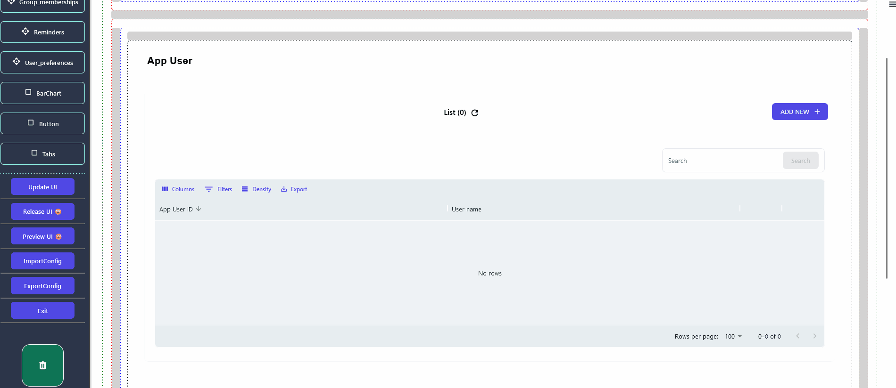
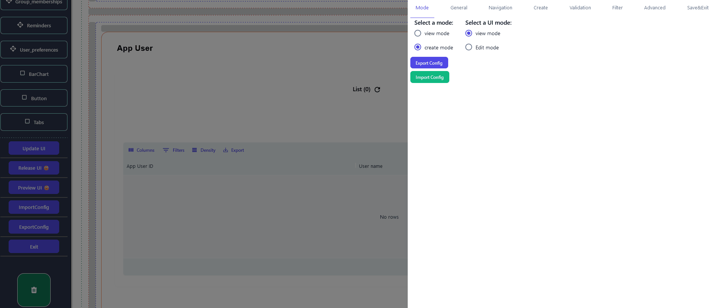
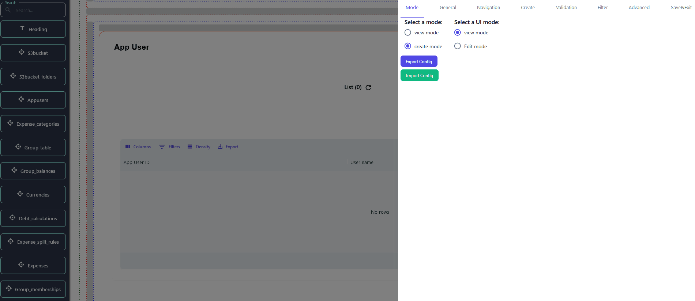
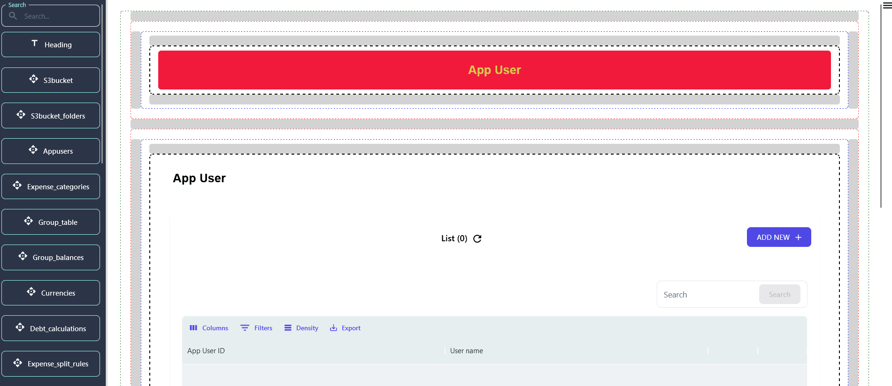

### Getting Started  

> Create mode in the [NeoApps.ai](https://neoapps.ai/) allows users to add new entries to their database, making it a crucial feature for applications that require data input. This guide will walk you through setting up and customizing the create mode for your application.

### Setting Up Create Mode

> To enable create mode for a component:

- Select the component you want to configure in create mode.
- Navigate to the component's settings panel and find the **Mode** option.
- Choose **Create** from the dropdown menu to switch the component to create mode.

### Customizing Input Fields

> In create mode, you can define which fields users will fill out to add new records:

- **Add Fields**: Drag and drop the desired fields from the component library into your component.

- **Field Properties**: Configure each field's properties, such as field name, data type, and default value.

### Implementing Validation Rules

> Validation ensures that the data entered by users meets specific criteria before submission:

1. **Required Fields**: Mark fields as required to prevent form submission without input.
2. **Data Type Validation**: Specify the data type for each field to ensure users enter the correct type of data (e.g., text, numbers, dates).
3. **Custom Validation Rules**: Create custom validation rules using conditional logic for more complex requirements.

### Enhancements for User-Friendly Data Entry

> To make data entry easier and more intuitive for users, consider implementing the following enhancements:

- **Field Labels and Descriptions**: Provide clear labels and descriptions for each field.
- **Placeholder Text**: Use placeholder text to give examples or further instructions.
- **Pre-filled Default Values**: Set default values for certain fields to save users time.

### Previewing and Testing

> Before finalizing your create mode configuration, it's essential to preview and test the functionality:

1. Utilize the preview feature within [NeoApps.ai](https://neoapps.ai/) to simulate the user experience of an application. 
2. Before accessing the preview, ensure the user interface (UI) is updated and released. 
3. Test the form functionality by entering data, validating all required fields, formats, and custom rules to ensure seamless operation.

### Next Steps

With create mode configured, you're one step closer to having a fully functional application. Explore the following topics to continue building and enhancing your app:

- [View and Edit Modes](./view-and-edit-modes.md)
- [Advanced Configuration for Technical Users](./advanced-configuration.md)

Create mode is a powerful feature that allows your application to interact dynamically with your database. By following the steps outlined in this guide, you can ensure that users have a smooth and efficient experience when adding new data to your application.