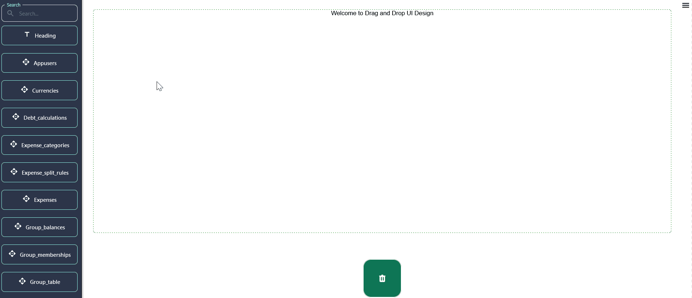
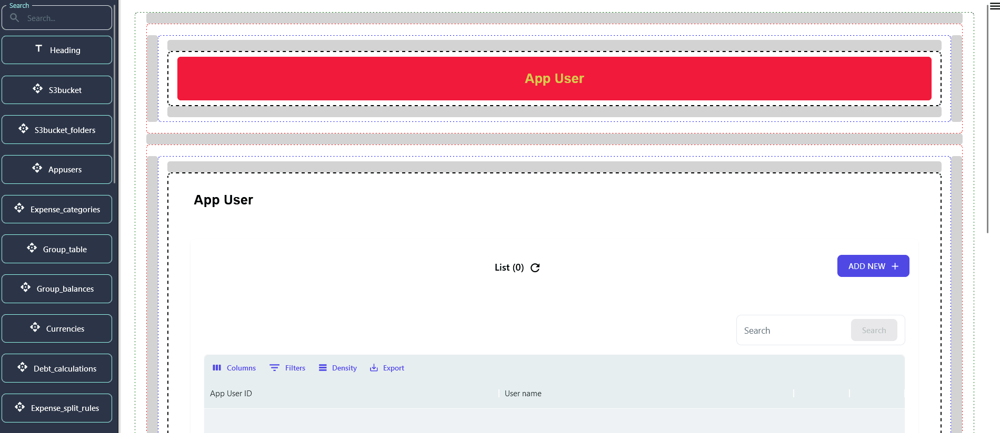

## Getting Started

> In this section, you will receive an overview of the Drag & Drop (DND) Dashboard, highlighting the types of components featured within it.

> Login into DND Builder using generated ‘Master Credentials’. 

> The provided image visually represents the appearance of the DND(drag & drop) dashboard, offering viewers a glimpse into its layout and design

## Comprehensive Tool Access and App Management:

1. **Database Table Components & More**

- Easily find and integrate various elements like database tables, charts, and tabs into your app by using the search functionality, enhancing your app’s functionality and user experience.

2. **Streamlined Development Tools**

- The bottom part of the left sidebar remains your go-to for saving changes (Update UI), publishing updates (Release UI), previewing your work (Preview UI), and managing configurations (Import/Export Config). The search box adds an extra layer of efficiency, helping you quickly navigate through these tools and components.

### Top Left Sidebar - Accessing Tools for Your App

> The sidebar on the top left of your screen is your toolbox, offering a variety of components to add to your app. Here you'll find:

1. **Database Table Components** : Drag & drop elements that represent the different tables in your database, allowing you to display and interact with your data.

2. **Chart Component** : Add visual data representations to make your app more informative and engaging.

- [Chart Component Usage](./chart-component-usage/chart-component.md)

3. **Tabs Component** : Incorporate tabs into your app for better organization and navigation, making it easier for users to find what they need.

- In the DND Builder, users can leverage the 'tab' component for seamless navigation between pages, enhancing user experience and ease of use.

### Bottom Part of Left Sidebar - Managing Your App's Development

1. **Update UI** : Clicking this saves any changes you've made to the app's interface directly into the database, ensuring your latest adjustments won't be lost.

2. **Release UI** : This crucial step publishes your app to the actual front-facing website or mobile app, making your updates available to your users.

3. **Preview UI** : Offers a sneak peek of your changes in real-time, mirroring your app's frontend. It's a safe way to check your work before making it live.

4. **Import Config / Export Config** :

   - **Import Config** : If you've previously saved your configuration settings, this option lets you upload those settings from your local computer. It's a time-saver, helping you avoid setting up everything from scratch. However, it's crucial that your database design hasn't changed since you last exported the configuration.

   - **Export Config** : This option packages your current configuration settings into a zip file containing three crucial files. When you want to replicate your setup elsewhere or back it up, use this feature. Be cautious and review each file to ensure they're correctly prepared for future importing.

5. **Exiting and Cleaning Up** :

   - **Exit** : When you're done, use this option to log out securely from the builder.

   - **Trash** : Made a mistake or changed your mind? Drag components you no longer need to the trash. This action helps keep your workspace clean and organized.

## Configuring Navigation and Component Interactions

> In application development, particularly within no-code platforms, the configuration of navigation and component hierarchy follows a bottom-up approach, emphasizing the importance of planning the user journey from the end state backward. Here's how to implement advanced navigation strategies:

### Structured Navigation Links:

> Implement navigation links within the app’s left menu, organizing them into a main/subpage hierarchy up to two levels deep. This structure aids in compartmentalizing the application into distinct functional areas, though main pages act as non-interactive headers to categorize the subpages.

### Popup and Sidebar Drawer Implementations:

> Components can be configured to appear as popups or sidebar drawers, offering dynamic interaction models for accessing content without leaving the current context. This flexibility supports a wide range of use cases, from detailed content review to quick access sidebars.

### Nested Component Pages:

> A more complex setup involves nesting multiple components within a single component page, allowing for the creation of layered views or tab interfaces. This requires careful planning of component-to-component navigation, ensuring each link correctly passes relevant data and context to subsequent components.

### Navigation View Variations:

> Navigation between components can be customized to suit different interaction patterns, such as direct redirects, slide-in drawers for supplementary information, or popups for focused content engagement. These patterns can be mixed and matched based on the data volume and user interaction goals, providing a tailored app experience.

## Next Step

> Begin configuring the Drag & Drop (DND) components according to your specifications by simply dragging and dropping them into the pages.
