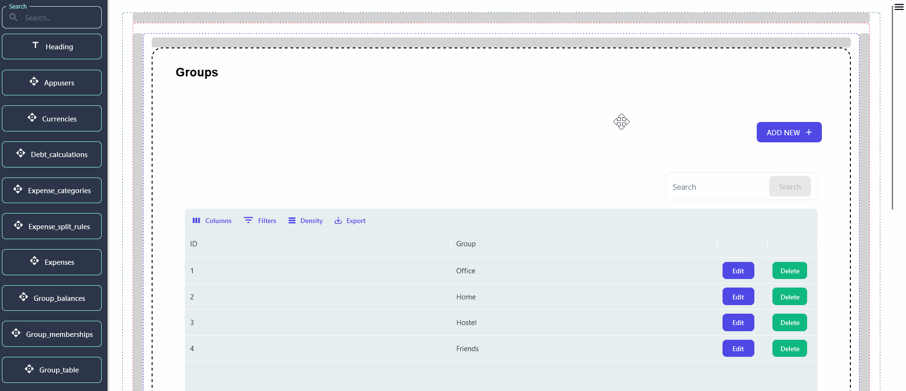
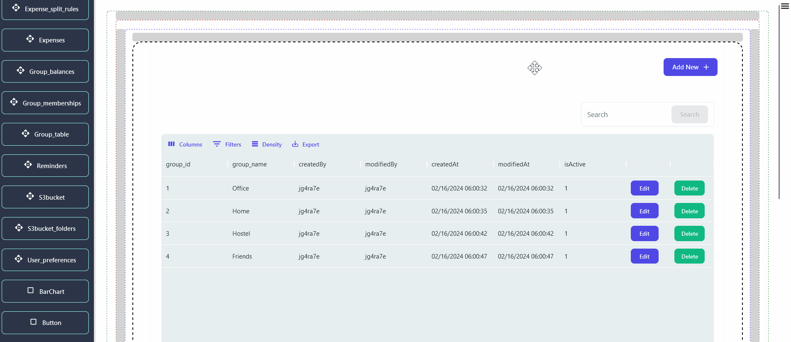
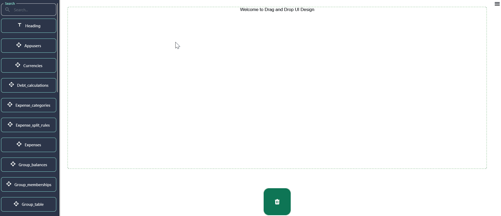

## Getting Started

> In this section, discover the seamless process of exporting your current DND configuration from the DND Builder. Learn how to efficiently import your exported configuration back into the DND Builder for easy setup and customization.

## Exporting DND Configuration: Essential Steps

> At your disposal in the DND Builder are two export options:**' one for exporting individual component configurations'** and **'another for exporting the entirety of your DND configuration'**. Choose the option that best suits your needs for seamless customization and sharing.

### 1. Exporting DND Component's configuration

> To export individual component configurations in the DND builder, double-click on the desired component, then navigate to the **"Mode"** section. Here, locate the **Export** button and click it to download the specific component's configuration. This streamlined process allows users to efficiently save and share component settings for further use.

### 2. Exporting Your Entire DND Configuration

> To export the entire DND configuration, simply locate and click on the **'Export'** button located at the bottom left corner of the sidebar in the DND Builder interface.This streamlined process allows users to efficiently save and share entire DND configuration for further use.

![Export entire Project]

## Importing DND Configuration: A Step-by-Step Guide

> In the DND Builder, users have access to two import options: one for importing the entire DND configuration and another for importing specific component configurations within individual component settings.

### 1. Importing DND Component's configuration

> To access component settings for import, double-click on the respective component. Within the settings, locate and click the **'Import'** button, which will then prompt a pop-up window where you can import your desired configuration.

> In the component configuration, locate the **config.json** file. Copy the contents of this file and paste them into the configuration box. Then, click on **'Confirm'** and proceed to click on the **'Save & Exit'** button to save the imported component configuration.

### 2. Importing Your Entire DND Configuration

> To import the entire DND configuration, locate and click on the **'Import'** button positioned at the bottom left corner of the sidebar within the DND Builder interface. This action will trigger a pop-up window where you can conveniently copy and paste your configuration settings into their respective sections.

> When exporting the entire project, a zip file containing three files (**'componentsFile.json'**, **'layoutFile.json'**, and **'UI_pagesFile.json'**) is downloaded. Each file contains different configurations. When importing the entire project, there are three sections in the pop-up import window. You'll need to copy the text from each file and paste it into the related box in the import window. After pasting the text, click on the **'Confirm'** button to save the changes.

