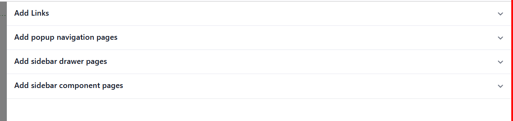
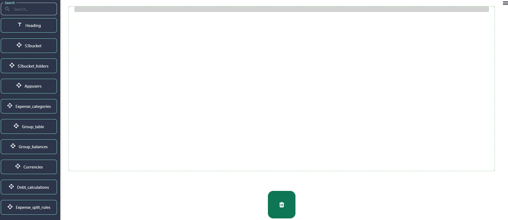
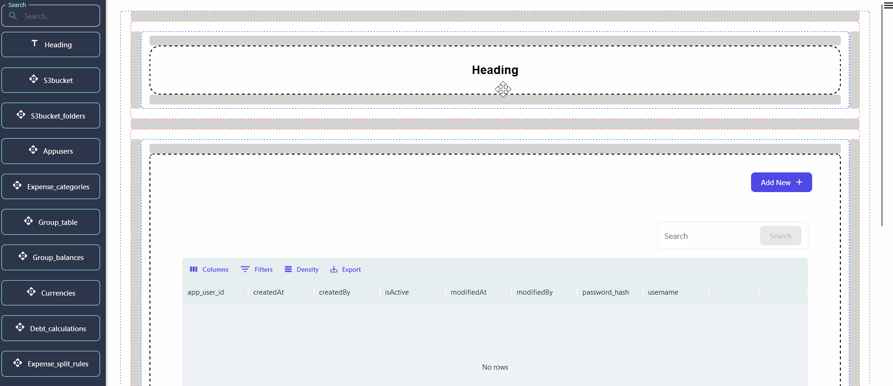

## Getting Started

> Bring your app ideas to life with [NeoApps.ai](https://neoapps.ai/) components! These pre-built building blocks let you quickly add functionalities and elements, from basic text and images to interactive forms and data tables. Perfect for beginners and technical users alike, components save you time and effort while ensuring a polished and professional look. Explore our library and discover buttons, menus, charts, social media feeds, and more! Start building your dream app today!

> This section offers a detailed, sequential guide to configuring the Drag and Drop (DnD) , providing clear instructions for each stage of the setup process.

## Mastering DnD Configuration: A Step-by-Step Guide

### Setting Up a Drag and Drop Component Page

> Our project offers four distinct types of pages to cater to varying needs:

1. **Add Simple Page**: A straightforward interface designed for effortless data entry.
2. **Popup Page**: Displays supplementary information or prompts in a modal dialog, enhancing user engagement.
3. **Sidebar Drawer Page**: Features a sliding sidebar for convenient access to additional features or navigation options.
4. **Sidebar Component Page**: Integrates a persistent sidebar for consistent access to supplementary functionalities.

> After selecting a page type, proceed with creating the designated page according to its specifications and requirements.then Select the created Page.

### Integrating Components via Drag and Drop

> Upon selecting the preferred page type, seamlessly integrate components onto the interface using intuitive drag-and-drop functionality.

### Fine-Tune Your App: Dive into Component Configuration

> Each component comes with its own set of configuration options, which can be accessed through the properties panel on the right side of the screen when a component is selected.

- **General Settings**: Configure essential parameters such as size, alignment, and visibility to optimize component functionality.

- **Styling**: Personalize the appearance of your component by adjusting attributes like color, font, and spacing for a polished look and feel.

- **Heading Component's general Setting**

- **Database Table's general Setting**

### Commonly Used Components

1. **Text Component** : The text component allows you to add headings, paragraphs, and links to your app. It's essential for providing information and guidance to your users.
2. **Image Component** : Use the image component to add visuals to your app. You can upload images directly or reference them via URL.
3. **Form Components** : Form components like input fields, dropdowns, and buttons are crucial for capturing user input and facilitating interactions.
4. **Data Table** : The data table component displays data in a structured format, allowing users to view and interact with large datasets efficiently.
5. **Chart Component** : The chart component is used for display different type of charts like bar, pie, line etc.. It Can be useful for showing data in different formats.
6. **Custom Components** : For more advanced needs, you can create custom components using HTML/CSS or integrate third-party libraries.

### Building Your App Like a Pro: Top Tips for Using Components

1. **Plan Your App's Look:**
   - Before diving in, imagine how you want your app to look. Sketch a simple layout on paper, like where you want buttons, text, and pictures. This helps make your app organized and easy to use.
2. **Group Things Together:**
   - Think of your app like a toolbox. Use "container" components like boxes to group related things together. This keeps your app tidy and makes it easier to move things around.
3. **Make Sure Your App Fits All Screens:**
   - Just like your clothes should fit you well, your app should look good on any phone, tablet, or computer. Check how your components adjust to different screen sizes regularly. This makes sure everyone has a great experience using your app. -->

## Next Steps

> Now that you're familiar with adding and configuring components, explore the following guides to dive deeper into creating dynamic and interactive applications:

- [Customizing Your App's Look with Easy Configuration](./ui-customization)
- [Customize Create Mode Configuration](../dnd-usage/Datatable-components-usage/create-mode-configuration.md)
- [Customize View and Edit Mode Configuration](../dnd-usage/Datatable-components-usage/view-and-edit-modes.md)
- [Advanced Configuration for Technical Users](./advanced-configuration)

> Components are a powerful way to build and customize your app without writing code. With the wide variety of components available in the [NeoApps.ai](https://neoapps.ai/), you can design almost any type of application. We encourage you to experiment with different components and configurations to discover the full potential of your app.
