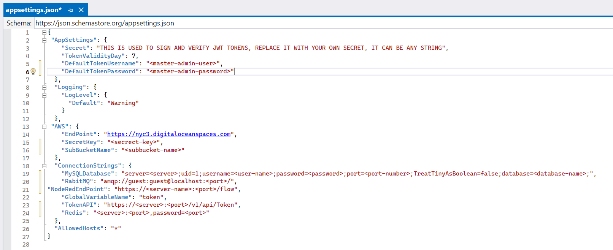

## Getting Started

> Explore the process of downloading various project components such as backend, frontend, and Node-RED flows from the portal, and gain insights into setting up these elements within your local environment for efficient development.

## Accessing Your Projects : Portal Download Guide

## Essential Steps Before Beginning : Project Prerequisites Checklist

> Before starting the project setup, make sure your system has the essential tools and dependencies listed below:

1. **An IDE such as VS Code**
2. **Node.js (Version >= 15.0.0)**
3. **Visual Studio with minimum .NET version 6**
4. **Docker**
5. **MySQL Workbench or XAMPP** 

## Getting Started Locally: Step-by-Step Instructions

> **Note :** Although this guide refers to the Split-the-bill project for demonstration purposes, the outlined steps can be universally applied to other projects with comparable requirements.

### 1. Database Setup Essentials

- Ensure MySQL Workbench or XAMPP is installed on your machine before proceeding with the database setup.

- For database setup, create a dedicated database for the project and execute the downloaded database script within it. Before running the script, ensure that you have selected the created database to create essential tables for your project.

### 2. Setting Up the Backend: Step-by-Step Instructions

- Begin by unzipping the backend part. Within the unzipped folder, navigate to the 'solution' -> '(project-name)' folder. Inside, you'll find six folders, each serving a distinct purpose in the project. Start by running the backend, then proceed to explore each folder in detail, step by step.

- For the project setup, launch main project in Visual Studio and navigate to the **'(project-name).API'** folder. Inside, locate the **'appsettings.json'** file and open it.Within the appsettings.json file, modify the configurations as specified.

> Start **Configuring the Connection Strings** in appsettings.json file : 

1. **Database Connection**

- In the **'ConnectionStrings'** section of the **appsettings.json** file, add the connection string for the local database under the key **'MySQLDatabase'**.

```
"MySQLDatabase":"server=<server>;uid=1;username=<user-name>;password=<password>;port=<port-number>;TreatTinyAsBoolean=false;database=<database-name>;"
```

2. **RabbitMQ Setup**

- Open the terminal and execute the following command to run the **RabbitMQ image** in Docker:

```
docker run -d --hostname rmq --name rabbit-server -p 15672:15672 -p 5672:5672 rabbitmq:3-management
```

- Then, add the URL link of the RabbitMQ image in the **'RabbitMQ'** section of the **appsettings.json** file:

```
"RabbitMQ": "amqp://<username>:<password>@localhost:15672/"
```

3. **Node-red Setup**


4. **Redis Setup**

- Set up Redis in Docker using the following command:

```
docker run -d --name redis-stack-server -p 6379:6379 redis/redis-stack-server:latest
```

- After running the Redis image in Docker, set the Redis connection string as shown below

```
"Redis": "localhost:6379"
        OR
"Redis": "127.0.0.1:6379"
```

5. **Token API**

- Update the 'TokenAPI' in the appsettings.json file with the URL of the Swagger token API.

```
"TokenAPI": "https://<swagger-server>:<swagger-port>/v1/api/Token" 
```

