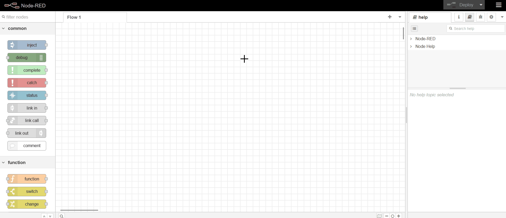

## Getting Started

> Explore the process of downloading various project components such as backend, frontend, and Node-RED flows from the portal, and gain insights into setting up these elements within your local environment for efficient development.

## Accessing Your Projects : Portal Download Guide

> If you wish to download your code, please contact us via chat. After some time, you'll receive a secure URL via email, which you can use to download your entire project. Simply click on the URL provided in the email to initiate the download process.


## Essential Steps Before Beginning : Project Prerequisites Checklist

> Before starting the project setup, make sure your system has the essential tools and dependencies listed below:

1. **An IDE such as VS Code**
2. **Node.js (Version >= 18.0.0)**
3. **Visual Studio with minimum .NET version 6**
4. **Docker**
5. **MySQL Workbench or XAMPP** 

## Getting Started Locally: Step-by-Step Instructions

> **Note :** Although this guide refers to the Split-the-bill project for demonstration purposes, the outlined steps can be universally applied to other projects with comparable requirements.

### 1. Database Setup Essentials

- Ensure MySQL Workbench or XAMPP is installed on your machine before proceeding with the database setup.

- For database setup, create a dedicated database for the project and execute the downloaded database script within it. Before running the script, ensure that you have selected the created database to create essential tables for your project.

### 2. Setting Up the Backend: Step-by-Step Instructions

- Start by unzipping the backend part. Inside the unzipped folder, go to the 'solution' -> '(project-name)' directory. Then, proceed with the following steps for the backend setup.

#### 1. Configuring Connection Strings in appsettings.json | (project-name).API Folder: 

>  For the project setup, launch main project in Visual Studio and navigate to the **'(project-name).API'** folder. Inside, locate the **'appsettings.json'** file and open it.Within the appsettings.json file, modify the configurations as specified.

1. **Database Connection**

- In the **'ConnectionStrings'** section of the **appsettings.json** file, add the connection string for the local database under the key **'MySQLDatabase'**.

```
"MySQLDatabase":"server=<server>;uid=1;username=<user-name>;password=<password>;port=<port-number>;TreatTinyAsBoolean=false;database=<database-name>;"
```

2. **RabbitMQ Setup**

- Open the terminal and execute the following command to run the **RabbitMQ image** in Docker:

```
docker run -d --hostname rmq --name rabbit-server -p 15672:15672 -p 5672:5672 rabbitmq:3-management
```

- Then, add the URL link of the RabbitMQ image in the **'RabbitMQ'** section of the **appsettings.json** file:

```
"RabbitMQ": "amqp://<username>:<password>@localhost:5672/"
```

3. **Node-red Setup**

- Before proceeding to download Node-RED locally on your OS, ensure that you have Node.js installed on your system with a version >= 18.0.0.

- To download and install Node-RED using the provided command, follow these steps:

1. Open your command prompt (cmd).
2. Run the following command to install Node-RED globally with the --unsafe-perm option:

```
npm install -g --unsafe-perm node-red
```

- Once Node-RED is installed, you can open it by running the node-red command in your command prompt. Remember that if you close the command prompt window, Node-RED will also be closed. So, keep the command prompt window open while using Node-RED.

- After downloading Node-RED locally, add the Node-RED connection string in the **'NodeRedEndPoint'** within the connection string as shown below:

```
"NodeRedEndPoint": "http://<server>:1880/flow"
```

4. **Redis Setup**

- Set up Redis in Docker using the following command:

```
docker run -d --name redis-stack-server -p 6379:6379 -e REDIS_PASSWORD=<your_password> redis/redis-stack-server:latest
```

- After running the Redis image in Docker, set the Redis connection string as shown below

```
"Redis": "<server>:6379,password:<your_password>;"
```

5. **Token API**

- Update the 'TokenAPI' in the appsettings.json file with the URL of the Swagger token API.

```
"TokenAPI": "https://<swagger-server>:<swagger-port>/v1/api/Token" 
```


#### 2. Configuring Connection Strings in appsettings.json | (project-name).Consumer Folder:

> Navigate to the **'(project-name)Consumer.API'** folder. Inside, find the **'appsettings.json'** file and open it. Adjust the configurations within the appsettings.json file as required.

1. **Database Connection**

- In the **'ConnectionStrings'** section of the **appsettings.json** file, add the connection string for the local database under the key **'MySQLDatabase'**.

```
"MySQLDatabase":"server=<server-name>;uid=1;username=<user-name>;password=<password>;port=<port-number>;TreatTinyAsBoolean=false;database=<database-name>;"
```

2. **RabbitMQ Setup**

- Add the URL link of the RabbitMQ image in the **'RabbitMQ'** section of the **appsettings.json** file:

```
"RabbitMQ": "amqp://<username>:<password>@localhost:15672/"
```


> After completing the setup, open both the **'(project-name).API'** and '**(project-name)Consumer.API'** projects in separate instances of Visual Studio. Then, simultaneously run both projects.

> You can begin testing various API endpoints in Swagger UI by providing a valid JWT Token. Refer to the documentation below for detailed instructions on utilizing the API in Swagger.

- [How to Use APIs in Swagger?](./User%20Guide/api-testing.md)

### 3. Frontend Setup : Getting Started Guide

> Before proceeding, unzip the frontend folder. Open the Frontend folder in VS Code or any IDE that supports ReactJS and NodeJS.

- Set the provided environment variable in the .env* files:
``` 
"REACT_APP_API_BASE_URL": `https://<server>:<port>/v1/api`
```

- To install packages, use the command:

```
 npm i 
  or 
 npm install
```

- To run the frontend part of the project, use the command:

```
npm run dev
```

### 4. Node-RED Setup: Comprehensive Guide

- To install Node-RED, use the following command:

```
npm install -g --unsafe-perm node-red
```

- After installation, open Node-RED by running the command 'node-red' in your command prompt. Remember not to close the command prompt, as doing so will also close Node-RED.

- To access the Node-RED UI, type the following URL into your browser:

```
http://<server>:1880
```

> After completing the previous step, the next step is to unzip the downloaded Node-RED zip file. Inside, you'll find a **'flows.json'** file which you need to import into your Node-RED instance. This will initiate the preparation and testing of workflows in Node-RED.



> You can refer to the sample flow provided in the link below for guidance on preparing and testing flows in Node-RED.

- [How to configure flows in Node-red?](./nodered-usage/sample-flow.md)