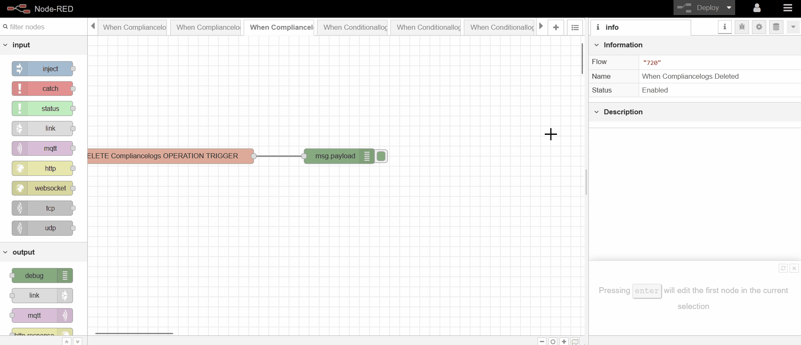

## Getting Started

> In this section, discover the seamless process of exporting your current workflow configuration from the Node-red.

## Exporting Workflows Configuration: Essential Steps

> To export Node-RED workflows from the Node-RED Dashboard, click on the hamburger icon in the top-right corner. Next, select 'Export' and, from the pop-up menu, choose whether you want to export all flows or only the current flow. Finally, click on 'Download' or 'Copy to Clipboard' to complete the process.

