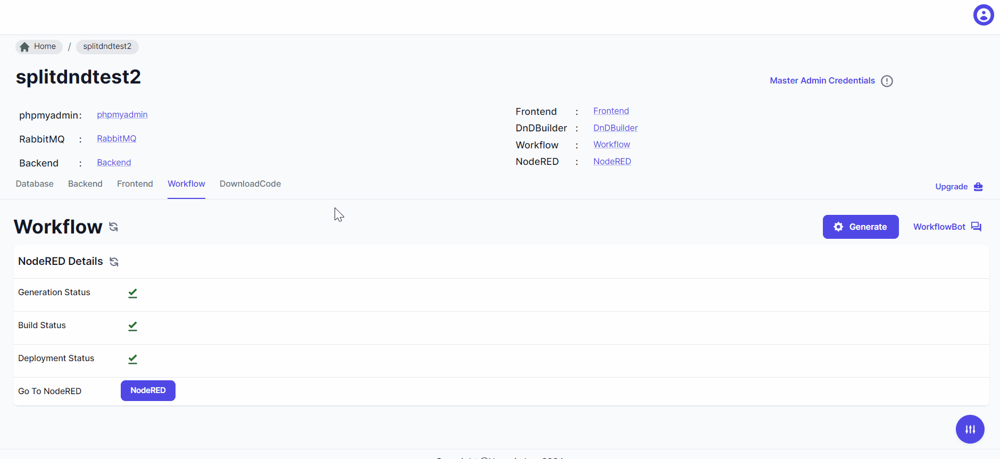

## Getting Started 

> You can refer this below link for workflow generation in Node-red. This workflow generator will generate default and simple flow in Node-red and deploy 

- [Nodered Workflow Generation](../User%20Guide/Project%20Creation/workflow_generation.md)

### How to Open Node-red?

> After Workflow genration and deployment there is one button 'Node-red' click on the button to open Node-red .

> For login in Node-red you have to use master admin credentials .

> After Login into the Node-red you can see below screen with flows .

### How to Use Node-red ?

> You can refer this below Node-red documentation link for more information .

- [Node-red Documentation](https://nodered.org/docs/)

### How to create simple flow in Node-red?

