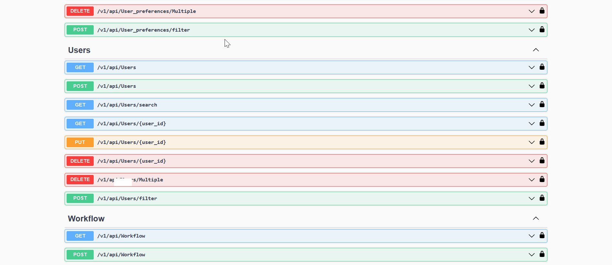

## Getting Started

> In this section, users can find references to sample Node-RED flows, offering practical demonstrations of workflows and automation scenarios.

> The '**Split the bill**' project is being used for configuring sample flows in node-red .

> **About Project** :
    - The "Split the Bill" project facilitates seamless expense management among groups. It leverages a relational database structure with tables such as Users, Appuser, Group Table, and more, to efficiently organize user data, group memberships, expense categories, and currency preferences. Through sophisticated debt calculations and expense splitting rules, the system ensures equitable distribution of expenses among group members.

## Demostrations : 

### Simple Flow in Node-red

- **Description** : Upon user registration, their data is initially stored in the Users table. Subsequently, an automated process triggers the following flow in Node-RED, facilitating the addition of the user to the App_user table for seamless data management across the system.


- To view this flow in Node-RED, you can copy the provided code snippet below and import it into your Node-RED instance. This will allow you to visualize the flow and explore the logic behind each node within the Node-RED editor.

```nodered
[{"id":"89","type":"subflow","name":"POST Appusers","info":"Used to Add New Record in **Appusers** table.","category":"Appusers","in":[{"x":160,"y":160,"wires":[{"id":"91"}]}],"out":[{"x":780,"y":160,"wires":[{"id":"92","port":0}]}],"env":[]},{"id":"91","type":"function","z":"89","name":"SET VARIABLES","func":"msg.headers = {\n    Authorization: global.get(\"token\"),\n};\nmsg.url = 'https://splitdndtest2.neoapps.ai/backend/v1/api/Appusers?page=1&itemsPerPage=100&orderBy=\"\"';\nmsg.payload = msg._appusers;\nreturn msg;","outputs":1,"noerr":0,"x":340,"y":160,"wires":[["92"]]},{"id":"92","type":"http request","z":"89","name":"POST Appusers","method":"POST","ret":"obj","paytoqs":false,"url":"","tls":"","proxy":"","authType":"","x":600,"y":160,"wires":[[]]},{"id":"25d92f75.7f9af","type":"subflow","name":"Add User operation trigger","info":"","category":"Users","in":[],"out":[{"x":820,"y":180,"wires":[{"id":"45bd1b88.7daf04","port":0}]}],"env":[]},{"id":"13d54957.c62747","type":"http in","z":"25d92f75.7f9af","name":"Add Operation Trigger","url":"/flow/Users/added","method":"post","upload":false,"swaggerDoc":"","x":270,"y":180,"wires":[["45bd1b88.7daf04"]]},{"id":"45bd1b88.7daf04","type":"function","z":"25d92f75.7f9af","name":"SET TOKEN TO GLOBAL VARIABLE","func":"msg._users = msg.payload;\nglobal.set(\"token\",msg.req.headers.authorization);\nreturn msg;","outputs":1,"noerr":0,"x":570,"y":180,"wires":[[]]},{"id":"2d304c8c.fe6324","type":"tab","label":"When User added","disabled":false,"info":"When user will be added, then this flow create that user's entry in Appuser"},{"id":"b16c2fce.57404","type":"subflow:25d92f75.7f9af","z":"2d304c8c.fe6324","name":"","env":[],"x":370,"y":200,"wires":[["beeaa894.b8e288"]]},{"id":"beeaa894.b8e288","type":"function","z":"2d304c8c.fe6324","name":"Create Appuser variable","func":"msg._appusers = {\n  \"username\": msg._users.username,\n  \"password_hash\" : msg._users.password_hash,\n  \"createdBy\": msg._users.createdBy,\n  \"modifiedBy\": msg._users.modifiedBy,\n  \"createdAt\": msg._users.createdAt,\n  \"modifiedAt\": msg._users.modifiedAt,\n  \"isActive\": msg._users.isActive\n}\n\nreturn msg;","outputs":1,"noerr":0,"x":630,"y":200,"wires":[["5cb1c8a7.11de58"]]},{"id":"5cb1c8a7.11de58","type":"subflow:89","z":"2d304c8c.fe6324","name":"","env":[],"x":840,"y":200,"wires":[["bf03c4ba.f2a798"]]},{"id":"bf03c4ba.f2a798","type":"debug","z":"2d304c8c.fe6324","name":"","active":true,"tosidebar":true,"console":false,"tostatus":false,"complete":"false","x":1050,"y":200,"wires":[]}]
```

- Once imported, you can navigate through the nodes, subflows, and functions to understand the flow's logic and customize it according to your requirements.

- **To run this flow, follow these steps:**

    1.  Post a user via the user API in Swagger.
    2.  In Node-RED, navigate to the debug panel.
    3.  Observe the result in the debug panel to see the output generated by the flow.



- This will allow you to monitor the flow's execution and view any debug messages or data emitted by the flow in response to the user creation event . 

### Complex Flow in Node-red (Multiple Operations)

- **Description** : This below flow automates the process of splitting expenses equally among group members in the Split the Bill project. Upon adding an expense to a group, it iterates through the group_membership table to allocate the expense evenly. Additionally, the flow updates the user_preference table to store the currency used for the expense.


- To view this flow in Node-RED, you can copy the provided code snippet below and import it into your Node-RED instance. 

```
[{"id":"603","type":"subflow","name":"POST User_preferences","info":"Used to Add New Record in **User_preferences** table.","category":"User_preferences","in":[{"x":160,"y":160,"wires":[{"id":"605"}]}],"out":[{"x":780,"y":160,"wires":[{"id":"606","port":0}]}],"env":[]},{"id":"605","type":"function","z":"603","name":"SET VARIABLES","func":"msg.headers = {\n    Authorization: global.get(\"token\"),\n};\nmsg.url = 'https://splitdndtest2.neoapps.ai/backend/v1/api/User_preferences?page=1&itemsPerPage=100&orderBy=\"\"';\nmsg.payload = msg._user_preferences;\nreturn msg;","outputs":1,"noerr":0,"x":340,"y":160,"wires":[["606"]]},{"id":"606","type":"http request","z":"603","name":"POST User_preferences","method":"POST","ret":"obj","paytoqs":false,"url":"","tls":"","proxy":"","authType":"","x":600,"y":160,"wires":[[]]},{"id":"474","type":"subflow","name":"ADD Expenses OPERATION TRIGGER","info":"## ### **MUST USE AS FIRST NODE**\n**Triggerd** When any **ADD** operation is performed on **database**.\n\nWhen call from **console** Application is made to **trigger** the **workflow**\nit is being made using the **URL** that is provided in **HTTP IN**\n**node** and **API** is set to **POST**.\n\nFunction node sets **TOKEN** which is for **Authorization** of **API**\nas **Global** varibale named **\"token\"** and also sets Object of the \nPayload to Message object Like.....\nIf the object came has name **Expenses**\nthen it will be stored as **msg._expenses**\nin **Message** object...","category":"Expenses","in":[],"out":[{"x":700,"y":120,"wires":[{"id":"476","port":0}]}],"env":[]},{"id":"473","type":"http in","z":"474","name":"Add Operation Triggered","url":"/flow/Expenses/added","method":"post","upload":false,"swaggerDoc":"","x":180,"y":120,"wires":[["476"]]},{"id":"476","type":"function","z":"474","name":"SET TOKEN TO GLOBAL VARIABLE","func":"msg._expenses = msg.payload;\nglobal.set(\"token\",msg.req.headers.authorization);\nreturn msg;","outputs":1,"noerr":0,"x":470,"y":120,"wires":[[]]},{"id":"490","type":"subflow","name":"GET ALL RECORDS","info":"Used to fetch **all the records** from a specified table using **GET** API call.\nThe Records will be stored in msg object as **msg._Records**.","category":"Group_memberships","in":[{"x":120,"y":80,"wires":[{"id":"491"}]}],"out":[{"x":660,"y":160,"wires":[{"id":"492","port":0}]}],"env":[]},{"id":"491","type":"function","z":"490","name":"GET ALL","func":"msg.headers = {\n    Authorization: global.get(\"token\"),\n};\nmsg.url = `https://splitdndtest2.neoapps.ai/backend/v1/api/Group_memberships?page=1&itemsPerPage=100&orderBy=\"\"`;\nreturn msg;","outputs":1,"noerr":0,"x":260,"y":80,"wires":[["493"]]},{"id":"493","type":"http request","z":"490","name":"Get All Records","method":"GET","ret":"obj","paytoqs":false,"url":"","tls":"","proxy":"","authType":"","x":200,"y":160,"wires":[["492"]]},{"id":"492","type":"function","z":"490","name":"SET MESSAGE VARIABLE","func":"msg._Group_memberships= msg.payload.document.records;\nreturn msg;\n","outputs":1,"noerr":0,"x":440,"y":160,"wires":[[]]},{"id":"310","type":"subflow","name":"POST Debt_calculations","info":"Used to Add New Record in **Debt_calculations** table.","category":"Debt_calculations","in":[{"x":160,"y":160,"wires":[{"id":"312"}]}],"out":[{"x":780,"y":160,"wires":[{"id":"313","port":0}]}],"env":[]},{"id":"312","type":"function","z":"310","name":"SET VARIABLES","func":"msg.headers = {\n    Authorization: global.get(\"token\"),\n};\nmsg.url = 'https://splitdndtest2.neoapps.ai/backend/v1/api/Debt_calculations?page=1&itemsPerPage=100&orderBy=\"\"';\nmsg.payload = msg._debt_calculations;\nreturn msg;","outputs":1,"noerr":0,"x":340,"y":160,"wires":[["313"]]},{"id":"313","type":"http request","z":"310","name":"POST Debt_calculations","method":"POST","ret":"obj","paytoqs":false,"url":"","tls":"","proxy":"","authType":"","x":600,"y":160,"wires":[[]]},{"id":"32e5de24.91fa12","type":"tab","label":"When expense added","disabled":false,"info":"When any expense will be added, then this flow will split that expense in group by creating entry in debt table and also make entry in user_prefrence table"},{"id":"239953f3.b36dcc","type":"subflow:310","z":"32e5de24.91fa12","name":"","env":[],"x":810,"y":340,"wires":[["c7427125.4182f"]]},{"id":"124a2bb4.76b2e4","type":"function","z":"32e5de24.91fa12","name":"Create Debt object","func":"var amount = msg._expenses.amount/msg._AppuserIdList.length;\n\nmsg._debt_calculations = {\n  \"group_id\": msg._expenses.group_id,\n  \"app_user_id\": msg._AppuserIdList[msg._index],\n  \"receiver_id\": msg._expenses.app_user_id,\n  \"amount\": amount,\n  \"currency_id\": msg._expenses.currency_id,\n  \"is_partial\": 1,\n  \"date\": msg._expenses.date,\n  \"createdBy\": msg._expenses.createdBy,\n  \"modifiedBy\": msg._expenses.modifiedBy,\n  \"createdAt\": msg._expenses.createdAt,\n  \"modifiedAt\": msg._expenses.modifiedAt,\n  \"isActive\": 1\n}\nmsg._index = msg._index + 1;\nreturn msg;","outputs":1,"noerr":0,"x":530,"y":340,"wires":[["239953f3.b36dcc"]]},{"id":"dd0733d9.cb9fb","type":"subflow:490","z":"32e5de24.91fa12","name":"","env":[],"x":180,"y":220,"wires":[["88c10a8f.9029d8"]]},{"id":"88c10a8f.9029d8","type":"function","z":"32e5de24.91fa12","name":"Filter By Group Id","func":"msg._AppuserIdList = [];\n\nfor (const item of msg._Group_memberships) {\n  if (item.group_id === msg._expenses.group_id && item.app_user_id != msg._expenses.app_user_id) {\n    msg._AppuserIdList.push(item.app_user_id);\n  }\n}\nmsg._index = 0;\nreturn msg;","outputs":1,"noerr":0,"x":430,"y":220,"wires":[["c7427125.4182f"]]},{"id":"c7427125.4182f","type":"loop","z":"32e5de24.91fa12","name":"Loop condition","kind":"cond","count":"","initial":"1","step":"1","condition":"msg._index < msg._AppuserIdList.length","conditionType":"js","when":"before","enumeration":"enum","enumerationType":"msg","limit":"","loopPayload":"loop-index","finalPayload":"final-count","x":640,"y":220,"wires":[["de149323.518a6"],["124a2bb4.76b2e4"]]},{"id":"de149323.518a6","type":"debug","z":"32e5de24.91fa12","name":"Output ","active":true,"tosidebar":true,"console":false,"tostatus":false,"complete":"true","targetType":"full","x":870,"y":220,"wires":[]},{"id":"d948f780.62e938","type":"subflow:474","z":"32e5de24.91fa12","name":"","env":[],"x":210,"y":80,"wires":[["dd0733d9.cb9fb","15695068.e5996"]]},{"id":"efad95c0.4c24e8","type":"subflow:603","z":"32e5de24.91fa12","name":"","env":[],"x":790,"y":80,"wires":[["74187996.15e7f8"]]},{"id":"15695068.e5996","type":"function","z":"32e5de24.91fa12","name":"Create user_prefrences object","func":"msg._user_preferences = {\n  \"app_user_id\": msg._expenses.app_user_id,\n  \"currency_id\": msg._expenses.currency_id,\n  \"reminder_frequency\": \"0\",\n  \"createdBy\": msg._expenses.createdBy,\n  \"modifiedBy\": msg._expenses.modifiedBy,\n  \"createdAt\": msg._expenses.createdAt,\n  \"modifiedAt\": msg._expenses.modifiedAt,\n  \"isActive\": 1\n}\nreturn msg;","outputs":1,"noerr":0,"x":520,"y":80,"wires":[["efad95c0.4c24e8"]]},{"id":"74187996.15e7f8","type":"debug","z":"32e5de24.91fa12","name":"Output","active":true,"tosidebar":true,"console":false,"tostatus":false,"complete":"true","targetType":"full","x":980,"y":100,"wires":[]}]
```

- Once imported, you can navigate through the nodes, subflows, and functions to understand the flow's logic and customize it according to your requirements.

- **To run this flow, Follow this steps :**

    1.  Post a Expanses via the user API in Swagger.
    2.  In Node-RED, navigate to the debug panel.
    3.  Observe the result in the debug panel to see the output generated by the flow.


### Workflow Using Third-party tool or API in Node-red

- **Description** : This below flow automates the process of notifying users when they are added to a group within the system. Upon addition to a group, the flow triggers an email notification to the respective user


- To view this flow in Node-RED, you can copy the provided code snippet below and import it into your Node-RED instance. 

```
[{"id":"531","type":"subflow","name":"ADD Group_memberships OPERATION TRIGGER","info":"## ### **MUST USE AS FIRST NODE**\n**Triggerd** When any **ADD** operation is performed on **database**.\n\nWhen call from **console** Application is made to **trigger** the **workflow**\nit is being made using the **URL** that is provided in **HTTP IN**\n**node** and **API** is set to **POST**.\n\nFunction node sets **TOKEN** which is for **Authorization** of **API**\nas **Global** varibale named **\"token\"** and also sets Object of the \nPayload to Message object Like.....\nIf the object came has name **Group_memberships**\nthen it will be stored as **msg._group_memberships**\nin **Message** object...","category":"Group_memberships","in":[],"out":[{"x":700,"y":120,"wires":[{"id":"533","port":0}]}],"env":[]},{"id":"530","type":"http in","z":"531","name":"Add Operation Triggered","url":"/flow/Group_memberships/added","method":"post","upload":false,"swaggerDoc":"","x":180,"y":120,"wires":[["533"]]},{"id":"533","type":"function","z":"531","name":"SET TOKEN TO GLOBAL VARIABLE","func":"msg._group_memberships = msg.payload;\nglobal.set(\"token\",msg.req.headers.authorization);\nreturn msg;","outputs":1,"noerr":0,"x":470,"y":120,"wires":[[]]},{"id":"2eeaf3ee.20c5dc","type":"tab","label":"Send Email ","disabled":false,"info":"This flow will send email to user who was added in a group"},{"id":"74bf4657.c90648","type":"subflow:531","z":"2eeaf3ee.20c5dc","name":"","env":[],"x":350,"y":240,"wires":[["62d2262a.f36738"]]},{"id":"62d2262a.f36738","type":"function","z":"2eeaf3ee.20c5dc","name":"Set Email Body","func":"msg.topic = \"Added in a group\";\n\n// We don't have email in database otherwise\n// you can get email id from there\nmsg.to = \"demo@gmail.com\";\nmsg.payload = \"You have been added into a group by \" + msg._group_memberships.createdBy + \" and your membership id is \" + msg._group_memberships.membership_id;\n\nreturn msg;","outputs":1,"noerr":0,"x":640,"y":240,"wires":[["c48b19da.7ee128","9dfa4ec6.9579e"]]},{"id":"c48b19da.7ee128","type":"e-mail","z":"2eeaf3ee.20c5dc","server":"smtp.gmail.com","port":"465","secure":true,"tls":true,"name":"","dname":"","x":830,"y":260,"wires":[]},{"id":"9dfa4ec6.9579e","type":"debug","z":"2eeaf3ee.20c5dc","name":"Output","active":true,"tosidebar":true,"console":false,"tostatus":false,"complete":"true","targetType":"full","x":830,"y":200,"wires":[]}]
```

- Once imported, you can navigate through the nodes, subflows, and functions to understand the flow's logic and customize it according to your requirements.

- **To run this flow, Follow this steps :**

    1.  Post a group_membership via the user API in Swagger.
    2.  In Node-RED, navigate to the debug panel.
    3.  Observe the result in the debug panel to see the output generated by the flow.

